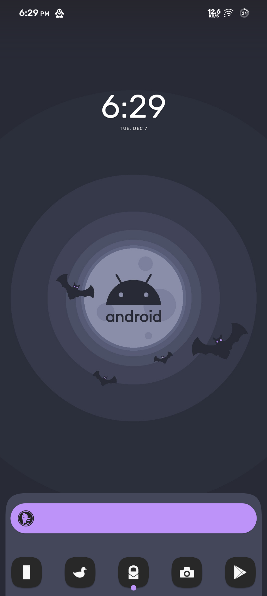
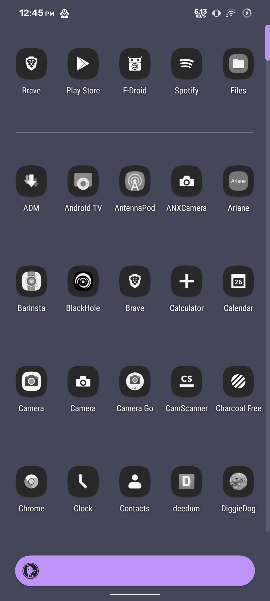

# Dracula for [Nova Launcher](https://novalauncher.com/)

> A dark theme for [Nova Launcher](https://novalauncher.com/).
> 

## Install

All instructions can be found at [draculatheme.com/nova-launcher](https://draculatheme.com/nova-launcher).

## Team

This theme is maintained by the following person(s) and a bunch of [awesome contributors](https://github.com/dracula/nova-launcher/graphs/contributors).

 |
--- |
[Scientiac](https://github.com/scientiac/) |

## License

[MIT License](./LICENSE)
